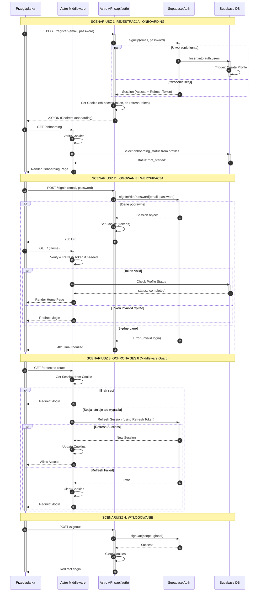

# Dokumentacja Procesu Autentykacji

## Analiza Wymagań

1. **Przepływy autentykacji:**
    * **Rejestracja (Sign Up):** Użytkownik podaje email/hasło -> Utworzenie konta w Supabase -> Automatyczne logowanie -> Przekierowanie do Onboardingu.
    * **Logowanie (Sign In):** Użytkownik podaje dane -> Weryfikacja w Supabase -> Ustawienie sesji (ciasteczka) -> Sprawdzenie statusu onboardingu -> Przekierowanie.
    * **Wylogowanie (Sign Out):** Żądanie wylogowania -> Usunięcie sesji w Supabase -> Wyczyszczenie ciasteczek -> Przekierowanie do logowania.
    * **Reset hasła:** Żądanie resetu -> Email z linkiem -> Kliknięcie w link (PKCE) -> Formularz nowego hasła -> Aktualizacja hasła.
    * **Weryfikacja sesji (Middleware):** Każde żądanie -> Sprawdzenie ciasteczka -> (Opcjonalnie) Odświeżenie tokenu -> Decyzja o dostępie (Guard).
    * **Usuwanie konta:** Żądanie usunięcia -> Usunięcie użytkownika w Supabase -> Kaskadowe usunięcie danych -> Wylogowanie.

2. **Główni aktorzy:**
    * **Przeglądarka (Użytkownik):** Inicjuje akcje, przechowuje ciasteczka.
    * **Middleware (Astro):** Strażnik tras, zarządza sesją i ciasteczkami po stronie serwera.
    * **Astro API (`/api/auth/*`):** Pośrednik między frontendem a Supabase, ukrywa logikę biznesową.
    * **Supabase Auth:** Dostawca tożsamości (IdP), zarządza tokenami (JWT).
    * **Supabase DB:** Przechowuje profile użytkowników, reaguje triggerami na nowe konta.

3. **Weryfikacja i odświeżanie tokenów:**
    * **Weryfikacja:** Middleware pobiera token z ciasteczek przy każdym chronionym żądaniu.
    * **Odświeżanie:** Jeśli Access Token wygasł, Middleware (przy użyciu `@supabase/ssr`) automatycznie próbuje go odświeżyć za pomocą Refresh Tokena. Jeśli się uda, aktualizuje ciasteczka. Jeśli nie, przekierowuje do logowania.

4. **Opis kroków:**
    * Proces zaczyna się od interakcji użytkownika (formularz).
    * Dane trafiają do Astro API (POST).
    * Astro API komunikuje się z Supabase Auth.
    * Supabase zwraca sesję lub błąd.
    * W przypadku sukcesu, Astro API ustawia ciasteczka `httpOnly`.
    * Middleware przy kolejnych żądaniach weryfikuje te ciasteczka i sprawdza status onboardingu w bazie danych (tabela `profiles`).

## Diagram Sekwencji

