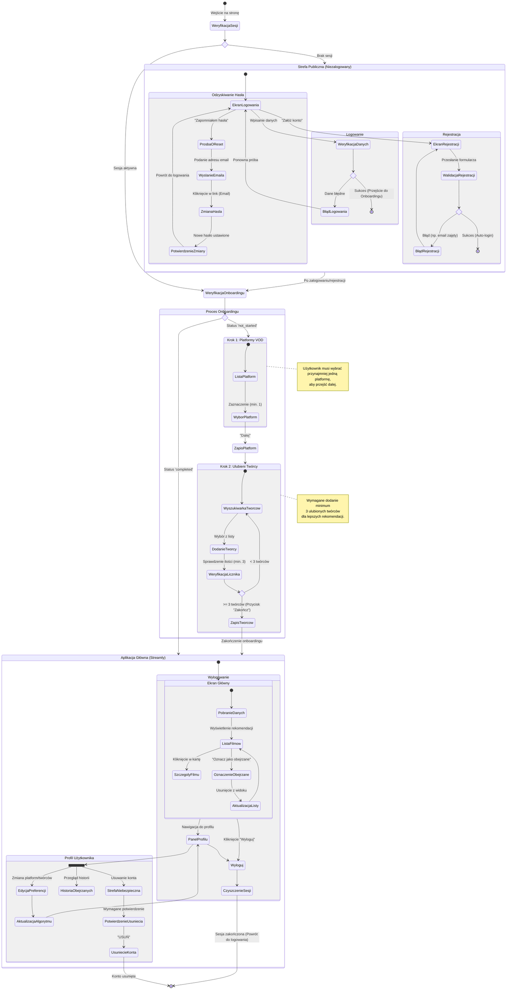

<user_journey_analysis>

1. Ścieżki użytkownika (z PRD i Auth Spec):
   - Nowy użytkownik: Rejestracja -> Onboarding (Platformy) -> Onboarding (Twórcy) -> Strona Główna.
   - Powracający użytkownik: Logowanie -> Strona Główna (lub dokończenie Onboardingu).
   - Zapomniane hasło: Formularz resetu -> Email -> Formularz zmiany hasła -> Logowanie.
   - Użytkownik zalogowany: Przeglądanie rekomendacji -> Oznaczanie jako obejrzane.
   - Zarządzanie profilem: Edycja platform/twórców, Przeglądanie historii, Wylogowanie, Usunięcie konta.
   - Niezalogowany użytkownik: Próba dostępu do funkcji chronionych -> Przekierowanie do logowania.

2. Główne podróże i stany:
   - **Autentykacja**: Logowanie, Rejestracja, Odzyskiwanie Hasła.
   - **Onboarding**: Wybór Platform, Wybór Twórców.
   - **Główna Aplikacja**: Strona Główna (Feed), Profil Użytkownika, Historia.

3. Punkty decyzyjne:
   - Czy użytkownik ma konto? (Login vs Rejestracja)
   - Czy dane logowania poprawne?
   - Czy onboarding zakończony? (Middleware check)
   - Czy token resetu hasła poprawny?
   - Decyzja o wylogowaniu lub usunięciu konta.

4. Opis stanów:
   - **EkranStartowy**: Punkt wejścia dla niezalogowanych.
   - **FormularzLogowania**: Wprowadzenie poświadczeń.
   - **FormularzRejestracji**: Utworzenie konta.
   - **ProcesResetu**: Ścieżka odzyskiwania dostępu.
   - **WybórPlatform**: Krok 1 onboardingu (deklaracja subskrypcji).
   - **WybórTworcow**: Krok 2 onboardingu (deklaracja preferencji).
   - **TablicaRekomendacji**: Główny widok z filmami/serialami.
   - **ZarzadzanieProfilem**: Edycja ustawień i historii.
</user_journey_analysis>

<mermaid_diagram>

</mermaid_diagram>
