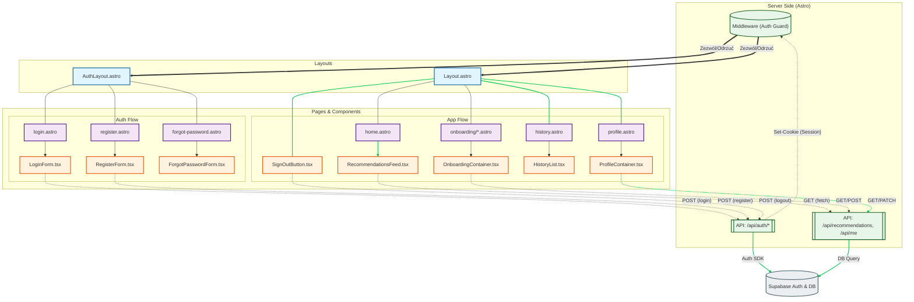

# Analiza Architektury UI

<architecture_analysis>

1. **Komponenty (na podstawie PRD i specyfikacji):**
    * **Layouty:**
        * `AuthLayout.astro`: Nowy layout dla stron autentykacji (Login, Rejestracja, Reset hasła). Minimalistyczny, brak nawigacji aplikacji.
        * `Layout.astro`: Główny layout aplikacji (istniejący). Zawiera nawigację, stopkę i logikę wylogowania (`SignOutButton`).
    * **Strony (Astro Pages):**
        * **Publiczne (Auth):** `login.astro`, `register.astro`, `forgot-password.astro`, `update-password.astro`.
        * **Prywatne (App):** `home.astro` (Dashboard), `profile.astro`, `history.astro`.
        * **Onboarding:** `onboarding/creators.astro`, `onboarding/platforms.astro`.
    * **Komponenty React (Interaktywne):**
        * **Auth:** `LoginForm`, `RegisterForm`, `ForgotPasswordForm`, `UpdatePasswordForm`, `SignOutButton`.
        * **Onboarding:** `OnboardingPlatformsContainer`, `OnboardingCreatorsContainer`, `CreatorSearch`, `PlatformGrid`.
        * **Core:** `RecommendationsFeed`, `HistoryList`, `ProfileContainer`, `ThemeToggle`.
    * **Backend/Logic:**
        * `Middleware`: Zarządzanie sesją, ochrona tras.
        * `API Endpoints`: `/api/auth/*` (proxy do Supabase), `/api/recommendations`, `/api/me/*`.

2. **Główne strony i komponenty:**
    * `/login` -> `AuthLayout` -> `LoginForm`
    * `/register` -> `AuthLayout` -> `RegisterForm`
    * `/` (Home) -> `Layout` -> `RecommendationsFeed`
    * `/profile` -> `Layout` -> `ProfileContainer` (zawiera `DeleteAccountDialog`)
    * `/onboarding` -> `Layout` -> `OnboardingSteps`

3. **Przepływ danych:**
    * **Autentykacja:** Użytkownik -> Formularz (React) -> `POST /api/auth` -> Supabase -> Cookie -> Middleware -> Przekierowanie.
    * **Aplikacja:** `Layout` weryfikuje sesję (SSR). Komponenty React (np. `RecommendationsFeed`) pobierają dane z API (`/api/recommendations`) używając ciasteczek sesyjnych.

4. **Opis funkcjonalności:**
    * **AuthLayout:** Zapewnia spójny wygląd dla stron logowania/rejestracji.
    * **Layout:** Obsługuje stan globalny UI (motyw) i nawigację.
    * **Middleware:** Strażnik dostępu, przekierowuje niezalogowanych do `/login` i zalogowanych z `/login` do `/`.
    * **Islands (React):** Obsługują interakcje (formularze, dynamiczne listy, filtrowanie) i komunikują się z API.
</architecture_analysis>

<mermaid_diagram>

</mermaid_diagram>
